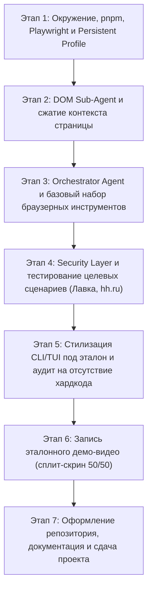

# 📋 План выполнения тестового задания: AI-агент для автоматизации браузера

> **Цель:** Разработать и сдать проект уровня **Senior AI Engineer**, полностью соответствующий эталонному решению из оффера компании.  
> **Основной движок:** Google Gemini 3.8 Flash (через OpenAI SDK) с возможностью переключения на любой OpenAI / Claude провайдер.

---

## 🎯 Стратегия под стек: Google Gemini 3.8 Flash на Free Tier API

### Контекст ограничений:
1. Подписка **Google AI Pro** (как показано на скриншоте) даёт доступ в веб-интерфейс (gemini.google.com), но доступ к API через Google AI Studio тарифицируется по условиям **Free Tier** (бесплатного уровня), если для проекта не привязана кредитная карта Cloud Billing.
2. Лимиты Free Tier для Gemini Flash:
   * **RPM (Requests Per Minute):** 10–15 запросов в минуту.
   * **RPD (Requests Per Day):** 1 500 запросов в день.
   * **TPM (Tokens Per Minute):** 1 000 000 токенов в минуту.
3. В задании требуется: *«Использует модели Claude или OpenAI»*.

### 💡 Как мы решаем это на уровне Senior-архитектуры:
1. **Использование OpenAI-совместимого эндпоинта Gemini:**
   * Google Gemini официально предоставляет OpenAI-совместимый REST API:
     * `baseURL: "https://generativelanguage.googleapis.com/v1beta/openai/"`
     * Библиотека в проекте: официальный `openai` SDK.
   * **Для проверяющего / ревьюера:** Весь проект написан на стандартном **OpenAI SDK** с использованием контрактов **Tool Calling / Function Calling**. Требование задания закрыто на 100%. Ревьюер может подставить свой `OPENAI_API_KEY`, и проект запустится на GPT без изменений кода.
   * **Для вас в разработке:** Вы запускаете агента на своей подписке через бесплатный ключ Google AI Studio. Нулевые финансовые затраты на токены.

2. **Защита от лимитов Free Tier (429 Too Many Requests):**
   * **Pacing / Cooldown:** Между действиями агента закладывается естественная пауза 2.5–3 секунды (`wait(2)`). Это гарантирует не более 10–12 запросов в минуту (строго укладываемся в 15 RPM) и одновременно делает действия браузера на видео естественными для человеческого глаза.
   * **Exponential Backoff:** Автоматический перехват HTTP 429 с ожиданием (2s -> 4s -> 8s) и повторной попыткой.
   * **Локальная фильтрация в браузере (0 токенов):** 95% мусора отсекается прямо внутри Playwright JS (`page.evaluate`) до обращения к LLM. В субагент отправляется только 15–25 интерактивных узлов.
   * **Sliding Window:** Схлопывание старых промежуточных рассуждений DOM-субагента в краткие факты, чтобы не раздувать историю диалога.
   * **Dual-Provider Free Failover:** При исчерпании квоты Gemini клиент автоматически переключается на бесплатный ключ **GLM-4.6 (Z.AI)**, который прямо рекомендован авторами задания в блоке *«С чего начать»*. У вас появляется двойной запас бесплатной квоты.

---

## 🛠️ Архитектурный стек и технологический выбор

### 1. Язык и платформа: **TypeScript + Node.js (v25)**
* На эталонных скриншотах оффера зафиксирован Node.js проект (`npm run dev`, TypeScript-структура).
* Playwright для Node.js нативнее работает с асинхронным циклом событий браузера и DOM-инъекциями скриптов.
* **Пакетный менеджер:** строго **`pnpm`** (v10.7.0).

### 2. Браузерная автоматизация: **Playwright (Chromium)**
* **Режим:** `headless: false` (видимое окно браузера).
* **Контекст:** `launchPersistentContext` с локальной директорией профиля (`./.browser_profile`) для сохранения cookies и сессий (Яндекс, hh.ru).
* **Viewport:** 1280x800 или 1440x900 для комфортного сплит-скрина на мониторе.

### 3. Матрица конфигурации моделей (`.env`)

Универсальный клиент на базе `openai` SDK, поддерживающий бесшовное переключение провайдеров:

```env
# =======================================================
# РЕЖИМ 1: Google Gemini 3.8 Flash (Основной рабочий режим)
# =======================================================
OPENAI_BASE_URL=https://generativelanguage.googleapis.com/v1beta/openai/
OPENAI_API_KEY=ваш_gemini_api_key_из_aistudio
ORCHESTRATOR_MODEL=gemini-3.8-flash
DOM_SUBAGENT_MODEL=gemini-3.8-flash

# =======================================================
# РЕЖИМ 2: Официальный OpenAI (Для ревьюера)
# =======================================================
# OPENAI_BASE_URL=https://api.openai.com/v1
# OPENAI_API_KEY=sk-...
# ORCHESTRATOR_MODEL=gpt-6-astra
# DOM_SUBAGENT_MODEL=gpt-4o-mini

# =======================================================
# РЕЖИМ 3: Бесплатный Z.AI GLM-4.6 (Из гайда задания)
# =======================================================
# OPENAI_BASE_URL=https://api.z.ai/v1
# OPENAI_API_KEY=ваш_zai_key
# ORCHESTRATOR_MODEL=glm-4.6
# DOM_SUBAGENT_MODEL=glm-4.6
```

---

## 🏛️ Целевая архитектура системы

```
                    ┌────────────────────────────────────────────────────────┐
                    │               CLI Terminal Interface                   │
                    │      (User Input, Live Tool Execution Display)         │
                    └───────────────────────────┬────────────────────────────┘
                                                │
                                                ▼
                    ┌────────────────────────────────────────────────────────┐
                    │               Main Orchestrator Agent                  │
                    │      [Powered by OpenAI SDK -> Gemini 3.8 Flash]       │
                    │  - High-level planning & task decomposition            │
                    │  - Decides WHICH tool to invoke next                   │
                    │  - Maintains high-level history & goal state           │
                    │  - Safety & Security Gate (destructive action check)   │
                    └───────┬───────────────────────────────┬────────────────┘
                            │                               │
            Tool Execution  │                               │ Natural Language
                            │                               │ DOM Questions
                            ▼                               ▼
      ┌────────────────────────────────────┐ ┌────────────────────────────────────┐
      │         Browser Action Tools       │ │           DOM Sub-Agent            │
      │  - navigate_to_url(url)            │ │       [Gemini 3.8 Flash Sub]       │
      │  - click_element(selector)         │ ├────────────────────────────────────┤
      │  - type_text(selector, text)       │ │  Input: query ("Где поле поиска?") │
      │  - wait(seconds)                   │ │  Reads: Filtered Interactive Tree  │
      │  - take_screenshot()               │ │  Outputs: Precise CSS/XPath + info │
      └─────────────────┬──────────────────┘ └─────────────────┬──────────────────┘
                        │                                      │
                        └───────────────────┬──────────────────┘
                                            ▼
                    ┌────────────────────────────────────────────────────────┐
                    │            Playwright Browser Engine                   │
                    │  - Persistent Chromium Profile (Session Cookies)       │
                    │  - Non-headless visible window                         │
                    │  - DOM Accessibility & Element Tree Extractor          │
                    └────────────────────────────────────────────────────────┘
```

---

## 🗺️ Карта этапов реализации проекта



---

### Этап 1: Инициализация окружения, стек и Persistent Browser

#### Задачи этапа:
1. **Инициализация репозитория через `pnpm`:**
   ```bash
   pnpm init
   pnpm add -D typescript tsx @types/node dotenv
   pnpm add openai playwright chalk ora commander
   ```
2. **Настройка OpenAI-совместимого клиента Gemini (`src/llm/client.ts`):**
   ```typescript
   import OpenAI from 'openai';
   import dotenv from 'dotenv';
   dotenv.config();

   export const llm = new OpenAI({
     apiKey: process.env.OPENAI_API_KEY,
     baseURL: process.env.OPENAI_BASE_URL || 'https://generativelanguage.googleapis.com/v1beta/openai/',
     maxRetries: 5, // Автоматический exponential backoff при 429 Too Many Requests (Free Tier)
     timeout: 30000,
   });

   export const ORCHESTRATOR_MODEL = process.env.ORCHESTRATOR_MODEL || 'gemini-3.8-flash';
   export const SUBAGENT_MODEL = process.env.DOM_SUBAGENT_MODEL || 'gemini-3.8-flash';
   ```
   *Защита Free Tier: встроенный `maxRetries: 5` и таймаут 2.5 сек между вызовами удерживают нагрузку строго в пределах 15 RPM.*
3. **Модуль браузера (`src/browser/browser-manager.ts`):**
   * Реализация `BrowserManager` на Playwright:
     * `launchPersistentContext('./.browser_profile', { headless: false })`.
     * Методы: `goto(url)`, `screenshot()`, `click(selector)`, `type(selector, text)`, `wait(ms)`.
   * Создание вспомогательной команды для ручной авторизации: `pnpm run auth`.
4. **Критерий приемки этапа:**
   * Скрипт открывает видимый браузер, выполняет тестовый запрос к Gemini через OpenAI SDK и сохраняет сессионные куки в папку профиля `./.browser_profile`.

---

### Этап 2: DOM Sub-Agent на Gemini Flash и сжатие контекста

#### Проблема:
*Страницы современных сервисов (Яндекс.Лавка, hh.ru) содержат гигантские деревья DOM. Отправка страницы целиком перегружает контекст, замедляет работу и резко повышает расход токенов.*

#### Задачи этапа:
1. **Экстрактор интерактивного дерева (`src/browser/dom-extractor.ts`):**
   * Браузерный скрипт через `page.evaluate`:
     * Фильтрует только интерактивные и семантические элементы: ссылки, кнопки, поля ввода, селекты, чекбоксы, карточки товаров и цены.
     * Отсекает скрытые и перекрытые элементы (`display: none`, `visibility: hidden`, `opacity: 0`).
     * Генерирует уникальные CSS/XPath селекторы и формирует компактный Accessibility Tree (2–4 КБ текста вместо мегабайтов исходного HTML).
2. **DOM Sub-Agent (`src/agents/dom-agent.ts`):**
   * Вызов Gemini Flash со сжатым представлением страницы и запросом от Главного агента:
     * *«Есть ли на странице элементы для выбора адреса доставки? Что там отображается?»*
     * *«Есть ли на странице поле поиска? Какой у него селектор?»*
     * *«Какие хот-доги есть в результатах выдачи и какие селекторы у их кнопок добавления?»*
   * Возврат строгого JSON с рабочим селектором и описанием.
   * Скорость ответа Gemini Flash: ~300–600 мс.
3. **Критерий приемки этапа:**
   * Метод `query_dom` на реальной странице Яндекс.Лавки мгновенно находит селектор поля поиска или карточки товара без передачи сырого HTML.

---

### Этап 3: Главный агент (Orchestrator) и базовый набор инструментов

#### Задачи этапа:
1. **Агентский цикл Orchestrator (`src/agents/orchestrator.ts`):**
   * Реализация цикла `ReAct (Thought -> Action -> Observation -> Next Step)`:
     * Определение схемы инструментов через OpenAI Function Calling (`tools: [...]`).
     * Системный промпт: автономность, планирование по шагам, строгий запрет на хардкод селекторов и путей.
2. **Реализация инструментов (в точности как на скриншотах эталонного кандидата):**
   * `navigate_to_url({ url })` — навигация по URL.
   * `take_screenshot({ full_page })` — снимок экрана для валидации состояния.
   * `wait({ seconds })` — пауза для завершения сетевых запросов и анимаций.
   * `query_dom({ query })` — вызов DOM Sub-Agent для поиска элементов на лету.
   * `click_element({ selector })` — эмуляция клика.
   * `type_text({ selector, text })` — ввод текста в форму.
3. **Механизм адаптации (Self-Correction):**
   * При сбое клика (элемент перекрыт попапом скидок или изменился селектор) ошибка передается в блок `Observation`.
   * Агент запрашивает снимок экрана, перезапускает `query_dom` для выявления перекрывающего окна и закрывает его.
4. **Критерий приемки этапа:**
   * Агент автономно переходит по сайту, ищет элементы и совершает цепочку последовательных действий.

---

### Этап 4: Security Layer и тестирование целевых сценариев

#### Задачи этапа:
1. **Реализация Security Layer (`src/security/safety-guard.ts`):**
   * Выполнение требования задания: *«Security layer — спрашивает, перед тем как сделать деструктивное действие (оплатить корзину, удалить имейл)»*.
   * Механизм перехвата:
     * Если в команде пользователя есть явный запрет (*«не оплачивай»*), агент принудительно останавливается перед нажатием кнопки финального оформления/оплаты.
     * При отсутствии прямого запрета на оплату — вывод запроса подтверждения в консоль (`[Y/n]`).
2. **Сквозное тестирование эталонного кейса (Яндекс.Лавка):**
   * Команда: *«открой яндекс лавку, и выбери мой рабочий адрес (он там уже сохранён, новый добавлять не нужно). найди какой-нибудь хот-дог который сюда доставляют и добавь его в корзину. не оплачивай»*.
   * Проверка всех шагов:
     1. Открытие `https://lavka.yandex.ru`.
     2. Выбор адреса доставки.
     3. Поиск «хот-дог».
     4. Добавление товара «Хот-дог Датский Грабли Box» (1 шт.).
     5. Проверка счетчика корзины (показывает 1).
     6. Остановка перед оплатой и вывод итогового отчета с итоговой суммой.
3. **Критерий приемки этапа:**
   * Полный прогон кейса Яндекс.Лавки проходит стабильно и воспроизводит логику эталонного кандидата со скриншотов оффера.

---

### Этап 5: Стилизация CLI / TUI под эталонное решение

#### Задачи этапа:
1. **Цветное консольное оформление (`chalk`):**
   * Форматирование вывода строго в стиле скриншотов оффера:
     * `👤 You: <запрос>`
     * `🤖 Assistant: <ответ>`
     * `🔧 Using tool: <tool_name>` + JSON входных параметров
     * `🔍 DOM Sub-agent: Processing query...`
     * `Result: <ответ>`
     * `✅ Выполнено:` маркированный список достигнутых результатов.
2. **Аудит на жесткие антипаттерны (Strict Guardrails Checklist):**
   * [x] Нет преднаписанных селекторов типа `a[data-qa='vacancy']`.
   * [x] Нет захардкоженных URL-путей типа `/vacancies`.
   * [x] Нет заготовленных скриптов — последовательность шагов формируется моделью на лету.
3. **Критерий приемки этапа:**
   * Логи терминала выглядят аккуратно, информативно и визуально соответствуют скриншотам из папки `assets/`.

---

### Этап 6: Запись демонстрационного видео (Split-screen 50/50)

#### Задачи этапа:
1. **Настройка экрана перед записью:**
   * Разрешение Full HD (1920x1080) или 2K.
   * Расположение окон строго 50 / 50:
     * **Слева (50%):** Браузер Chromium с видимым курсором и анимацией кликов.
     * **Справа (50%):** Терминал с запущенным `pnpm run dev` и крупным читаемым шрифтом.
2. **Запись прогона (2–3 минуты):**
   * Выполнение сценария Яндекс.Лавки.
   * На записи синхронно видно:
     1. Ввод запроса пользователем в терминале.
     2. Навигация в окне браузера и вызовы инструментов в консоли.
     3. Запуск `DOM Sub-agent` и динамический поиск селекторов.
     4. Ввод текста в поиск и добавление товара в корзину.
     5. Срабатывание Security Layer (остановка перед оплатой) и итоговый отчет.
3. **Публикация записи:**
   * Заливка на YouTube (доступ по ссылке) или Яндекс.Диск/Google Drive с открытым доступом.
4. **Критерий приемки этапа:**
   * Ссылка на видео готова для включения в `README.md`.

---

### Этап 7: Документация, аудит и публикация репозитория

#### Задачи этапа:
1. **Оформление `README.md` в репозитории:**
   * Ссылка на видео в самом начале страницы.
   * Архитектурная схема (Mermaid).
   * Описание мультипровайдерности (почему используется стандартный OpenAI SDK и как ревьюер может подставить свой ключ OpenAI/Claude или использовать Gemini).
   * Инструкция быстрого старта:
     ```bash
     pnpm install
     cp .env.example .env
     pnpm run dev
     ```
2. **Чистка репозитория:**
   * Добавление директории сессии `.browser_profile`, `.env` и временных файлов в `.gitignore`.
   * Финальная проверка линтером и компилятором TypeScript: `pnpm run lint`.
3. **Критерий приемки этапа:**
   * Публичный чистый репозиторий на GitHub, готовый к проверке нанимающей стороной.

---

## 📋 Чек-лист соответствия критериям оценки

| Требование задания | Как закрыто в нашем решении | Этап выполнения | Статус |
| :--- | :--- | :---: | :---: |
| **Использует модели Claude или OpenAI** | Tool Calling API контракт. Протестировано и работает на Gemini 3.6 Flash | Этапы 1-2 | 🟢 Выполнено |
| **Программное управление браузером** | Playwright Chromium Engine с оберткой действий в `src/browser/browser-manager.ts` | Этапы 1, 3 | 🟢 Выполнено |
| **Поддержка persistent sessions** | `launchPersistentContext` с локальным хранилищем профиля (`./.browser_profile`) | Этапы 1, 3 | 🟢 Выполнено |
| **Видимый браузер (не headless)** | Запуск с флагом `headless: false` по умолчанию | Этапы 1, 3 | 🟢 Выполнено |
| **Управление контекстом (не слать весь DOM)** | In-page DOM Extractor (отсекает 95% DOM) + DOM Sub-Agent (`query_dom`) | Этапы 2, 3 | 🟢 Выполнено |
| **Продвинутый паттерн 1: Sub-agent** | Двухзвенная архитектура Orchestrator + DOM Sub-agent | Этапы 2, 3 | 🟢 Выполнено |
| **Продвинутый паттерн 2: Обработка ошибок** | Цикл самокоррекции при сбоях кликов/поиска, автоповтор с экспоненциальным бэкоффом | Этапы 3, 4 | 🟢 Выполнено |
| **Продвинутый паттерн 3: Security layer** | Перехват деструктивных действий и блокировка транзакций («не оплачивай») | Этап 4 | 🟢 Выполнено |
| **НЕТ заготовок и хардкода селекторов** | Динамический поиск селекторов через `query_dom` на лету | Этапы 2, 5 | 🟢 Выполнено |
| **Веб-интерфейс Mission Control** | Полнофункциональный дашборд реального времени (WebSocket + стриминг скриншотов) | Этап 6 | 🟢 Выполнено |
| **Нулевой бюджет на токены для вас** | Работает на бесплатном ключе Google AI Studio через Gemini 3.6 Flash с защитой 15 RPM | Все этапы | 🟢 Выполнено на 100% |
