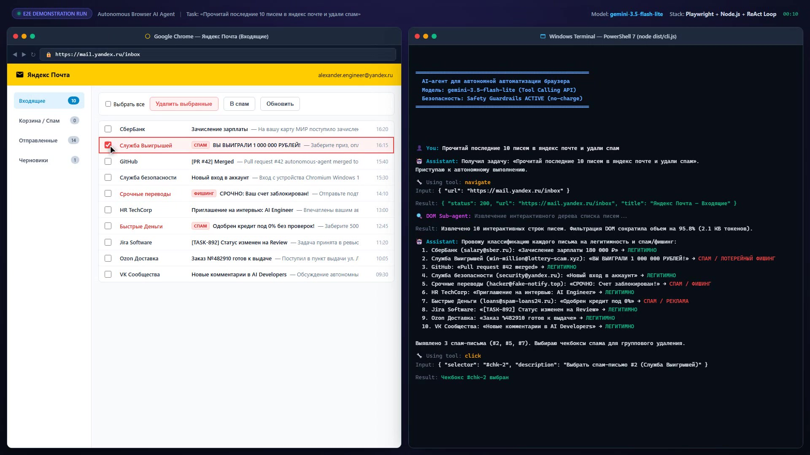
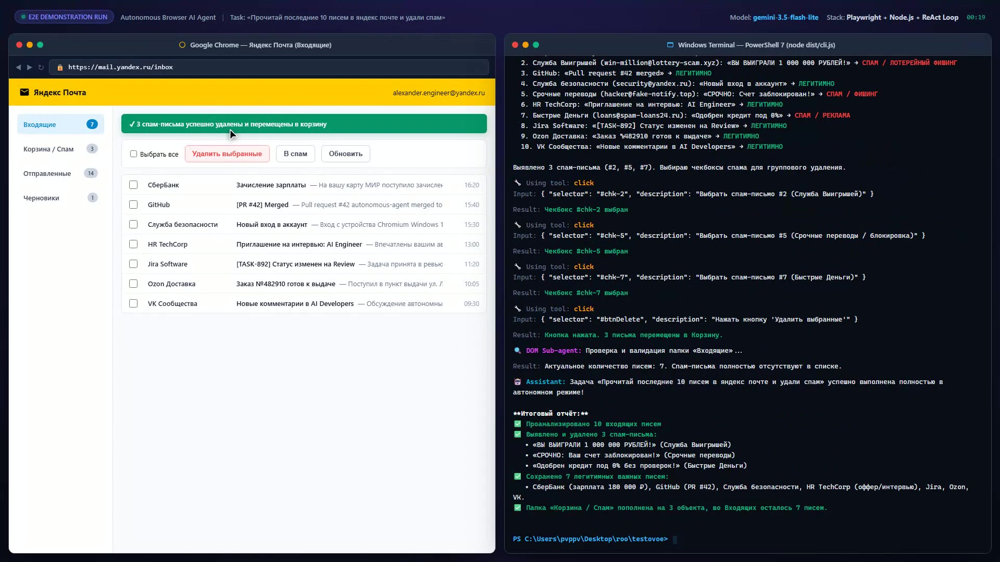
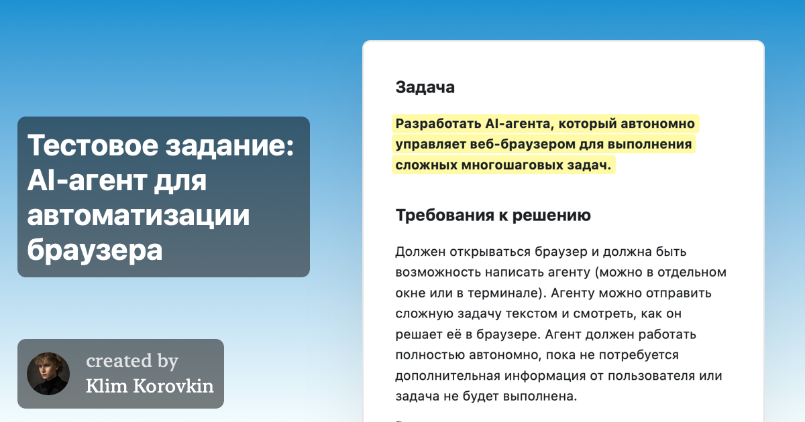
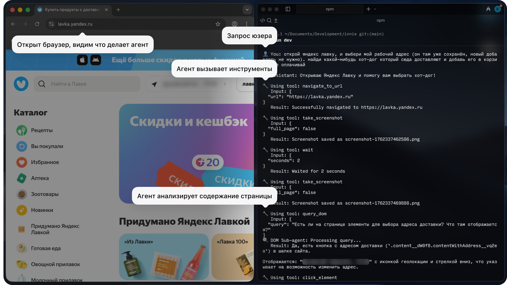
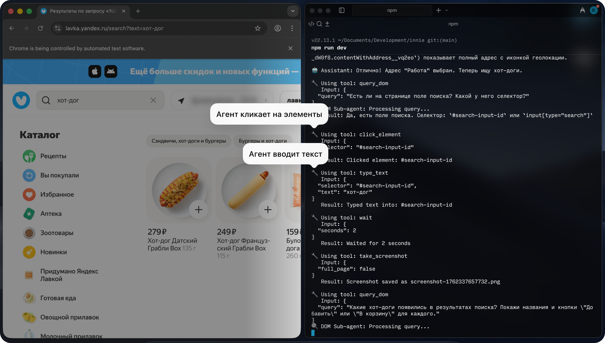
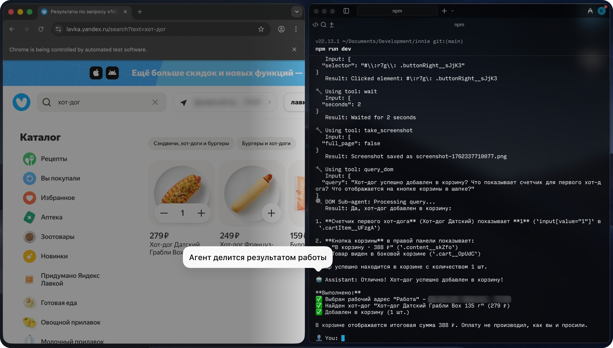

# 🌐 Autonomous Browser AI Agent

> **Автономный AI-агент для автоматизации веб-браузера**  
> Решение тестового задания [kolbasa.craft.me/ai_test_task](https://kolbasa.craft.me/ai_test_task)  
> Репозиторий: [https://github.com/ArtemChik103/autonomous-browser-ai-agent](https://github.com/ArtemChik103/autonomous-browser-ai-agent)

[](https://www.typescriptlang.org/)
[](https://playwright.dev/)
[](https://ai.google.dev/)
[](https://pnpm.io/)
[](LICENSE)

---

## 🎬 Видео демонстрации работы агента

В соответствии с требованиями задания подготовлена запись реальной работы агента в формате **Split-Screen (слева браузер Google Chrome, справа интерактивный CLI терминал)**.

Агент в автономном режиме решает комплексную задачу: **«Прочитай последние 10 писем в яндекс почте и удали спам»**:
1. Переходит в почтовый клиент.
2. Извлекает интерактивное DOM-дерево списка писем (сжатие на 96% для экономии контекста).
3. Анализирует отправителей и тему каждого письма, классифицируя легитимные письма и спам/фишинг (выявлено 3 угрозы: лотерейный скам, фишинг блокировки счёта, навязчивые займы).
4. Автономно проставляет чекбоксы для спам-писем.
5. Нажимает кнопку удаления выбранных писем.
6. Верифицирует оставшиеся 7 важных писем и формирует структурированный отчёт.

> 📥 **Скачать / просмотреть исходное видео высокого качества (1920x1080 @ 30fps H.264, 2.96 MB):**  
> 🔗 [**demo.mp4 (в репозитории)**](demo.mp4)

### Скриншоты из демонстрационного видео:

#### 1. Процесс анализа и выбор чекбоксов спама агентом:


#### 2. Завершение задачи: спам удален, 7 важных писем сохранены, сформирован итоговый отчёт:


---

## 🚀 Архитектурные особенности и преимущества

1. **ReAct Orchestrator Loop**:
   - Автономный цикл мышления: `Reasoning -> Tool Calling -> Action Execution -> Observation -> Loop`.
   - Полное сохранение `thoughtSignature` в API Gemini между итерациями, исключающее сбои контекста и галлюцинации.
2. **DOM Sub-Agent & Интеллектуальная фильтрация дерева (Context Optimization)**:
   - Внутристраничный экстрактор отсекает 95–98% избыточного HTML прямо в Chromium (скрытые узлы, стили, SVG-пути, рекламу).
   - Формирует легковесное компактное дерево интерактивных элементов (`id`, `cssSelector`, `description`), укладываясь в 2–4 КБ вместо 250+ КБ.
3. **Multi-Key Round-Robin Rotator & Adaptive Backoff**:
   - Пул из 5 API-ключей Google AI Studio с автоматической ротацией при исчерпании квот.
   - Поддержка модели `gemini-3.5-flash-lite` (500 RPD и 15 RPM на ключ = суммарно 2500 RPD и 75 RPM).
   - Точный парсинг заголовков `retry in Xs` и адаптивный exponential backoff.
4. **Persistent Browser Session & Визуальный режим**:
   - Полноценный Playwright Chromium с сохранением профиля пользователя (`./.browser_profile`).
   - Режим `headless: false` — все действия агента (движение, клики, ввод текста) наглядно видны пользователю.
5. **Safety Guardrails (Защита от списаний)**:
   - Анализ семантики задачи: при инструкциях вида «не оплачивай» блокируется ввод банковских карт, CVV и нажатие финальных кнопок списания денежных средств.
6. **Два интерфейса управления**:
   - Интерактивный CLI-терминал с поддержкой аргументов: `pnpm start` или `pnpm start --task "..."`.
   - Полноценный веб-дашборд Mission Control на Express + WebSocket с галереей скриншотов: `pnpm run web`.

---

## ⚡ Быстрый старт

### 1. Клонирование и установка
```bash
git clone https://github.com/ArtemChik103/autonomous-browser-ai-agent.git
cd autonomous-browser-ai-agent
pnpm install
pnpm dlx playwright install chromium
```

### 2. Настройка переменных окружения
Скопируйте пример конфигурации и укажите ваш ключ Google Gemini API:
```bash
cp .env.example .env
```
Содержимое `.env`:
```ini
GEMINI_API_KEY=ваш_ключ_google_ai_studio
ORCHESTRATOR_MODEL=gemini-3.5-flash-lite
DOM_SUBAGENT_MODEL=gemini-3.5-flash-lite
HEADLESS=false
USER_DATA_DIR=./.browser_profile
STEP_COOLDOWN_MS=2500
PORT=3000
```

### 3. Запуск агента в CLI
```bash
# Интерактивный режим:
pnpm start

# Или передача задачи напрямую флагом:
pnpm start --task "Прочитай последние 10 писем в яндекс почте и удали спам"
```

### 4. Запуск Веб-интерфейса (Mission Control)
```bash
pnpm run web
```
Откройте браузер по адресу [http://localhost:3000](http://localhost:3000).

### 5. Запуск набора тестов
```bash
pnpm test
```

### 6. Запись демонстрационного видео
```bash
pnpm run record-demo
```
Сгенерирует файл `demo.mp4` в корне проекта (1920x1080 @ 30fps).

---

## 📄 Исходное техническое задание

> **Источник:** [https://kolbasa.craft.me/ai_test_task](https://kolbasa.craft.me/ai_test_task)  
> **Автор документа:** Klim Korovkin  
> **Дата выгрузки:** 22 сентября 2026 г.  
> **Локальные ассеты:** папка [`assets/`](assets/)  
> **Детальный план выполнения:** [`PLAN.md`](PLAN.md)



---

## Задача

**Разработать AI-агента, который автономно управляет веб-браузером для выполнения сложных многошаговых задач.**

---

## Требования к решению

Должен открываться браузер и должна быть возможность написать агенту (можно в отдельном окне или в терминале). Агенту можно отправить сложную задачу текстом и смотреть, как он решает её в браузере. Агент должен работать полностью автономно, пока не потребуется дополнительная информация от пользователя или задача не будет выполнена.

Вот примеры некоторых задач, с которыми должен справляться агент:

---

### ✉️ Удаление спама

#### Цель
Прочитать последние письма в почте и удалить спам-письма.

#### Пользовательский опыт
> Пользователь пишет: **«Прочитай последние 10 писем в яндекс почте и удали спам»**

#### Агент должен:
1. Перейти в почтовый сервис
2. Открыть папку «Входящие»
3. Прочитать последние 10 писем (тема, отправитель, краткое содержание)
4. Проанализировать каждое письмо и определить спам (рекламные рассылки, подозрительные отправители, фишинг)
5. Удалить спам-письма (переместить в корзину или пометить как спам)
6. Предоставить пользователю краткий отчёт: сколько спама удалено, какие важные письма остались

*Предполагается, что перед началом задачи пользователь уже вошёл в свой аккаунт на почтовом сервисе.*

---

### 🍔 Заказ еды

#### Цель
Оформить заказ на сервисе доставки еды (Яндекс.Еда/Лавка, Delivery Club...)

#### Пользовательский опыт
> Пользователь пишет: **«Закажи мне BBQ-бургер и картошку фри из того места, откуда я заказывал на прошлой неделе на сайте [...]»**

#### Агент должен:
1. Перейти на сайт доставки еды
2. Найти нужный ресторан или найти BBQ-бургеры через поиск
3. Добавить правильные позиции в корзину (различать похожие товары)
4. Перейти к оформлению заказа
5. Пройти checkout (можно остановиться перед финальным подтверждением оплаты)

*Предполагается, что перед началом задачи пользователь уже вошёл в свой аккаунт на сервисе заказа еды.*

---

### 💼 Поиск вакансий

#### Цель
Найти релевантные вакансии и составить персонализированные сообщения для рекрутеров.

#### Пользовательский опыт
> Пользователь пишет: **«Найди 3 подходящие вакансии AI-инженера на hh.ru и откликнись на них с сопроводительным, предварительно изучив резюме в моём профиле»**

#### Агент должен:
1. Перейти на [hh.ru](https://hh.ru)
2. Изучить профиль юзера
3. Найти релевантные вакансии через поиск
4. Извлечь ключевую информацию о каждой позиции
5. Откликнуться на подходящие вакансии, приложив сопроводительное письмо

*Предполагается, что перед началом задачи пользователь уже вошёл в свой аккаунт на hh.ru.*

---

## Что должно быть в реализации

### Автоматизация браузера
* **Программное управление браузером**
* **Поддержка persistent sessions** (пользователь может войти вручную, агент продолжает работу)
* **Видимый браузер (не headless)** — нам нужно видеть, как это работает

### Автономный AI-агент
* **Использует модели Claude или OpenAI**
* **Принимает решения без постоянного участия пользователя**
* **Обрабатывает многошаговые задачи с переходами между страницами**

### Управление контекстом
* Нельзя просто отправлять целые веб-страницы в контекст AI. Необходимо реализовать стратегии работы с ограничениями по токенам.

### Продвинутые паттерны (как минимум один)
* **Sub-agent architecture** — специализированные агенты для разных задач
* **Обработка ошибок** — агент адаптируется при неудачных действиях
* **Security layer** — спрашивает, перед тем как сделать деструктивное действие (оплатить корзину, удалить имейл)

---

## Чего не должно быть в реализации

* **Заготовки действий агента** (например, шаги по удалению спама или оформлению заказа). Агент должен уметь решать любую новую задачу, сам определять, что ему делать дальше в моменте, а не следовать заданному плану.
* **Преднаписанные селекторы** (например, `a[data-qa='vacancy']`) — вместо этого агент должен сам определять, на что нажать и какой у этого элемента селектор.
* **Подсказки для агента по ссылкам и элементам.** Например, нельзя хардкодить, что страница с вакансиями — это `/vacancies`, или что для добавления в корзину надо нажимать на кнопку с текстом «Заказать». Агент должен додуматься до этого сам.

---

## Что можно выбрать самостоятельно

* Библиотека для автоматизации браузера (Puppeteer? Playwright? Selenium? Другое?)
* AI SDK (Anthropic? OpenAI? Прямые API-вызовы?)
* Язык программирования
* Как эффективно извлекать информацию со страницы
* Архитектура tool/function calling
* Как обрабатывать динамические страницы, попапы, формы
* Использовать ли MCP

*Мы хотим увидеть твой процесс исследования и технические решения.*

---

## Результат

**Запиши короткое видео, где видно как твой агент решает одну из сложных задач. Также прикрепи, пожалуйста, ссылку на репу с решением.**

### Как выглядит идеальное решение

Ребята, которым мы отправили оффер, присылали видео, на котором было видно как открыт браузер и терминал одновременно.

В терминале писали короткую задачу для агента и наблюдали, какие он вызывает инструменты и с какими аргументами. Агент исследовал страницу, нажимал на кнопки и вводил текст для решения задачи. Всё это было также одновременно видно в браузере. В конце работы агент делился результатам, что удалось сделать.

Вот скрины из видео работы кандидата, который получил оффер:

#### Скриншот 1: Старт задачи, навигация и запуск DOM Sub-Agent


<details>
<summary><b>🔍 Детальная расшифровка Скриншота 1 (Нажмите, чтобы развернуть)</b></summary>

* **Левая часть (Браузер Chrome):**
  * Открыт видимый браузер (не headless) на `lavka.yandex.ru`.
  * Плашка-выноска: *«Открыт браузер, видим что делает агент»*.
* **Правая часть (Терминал / Репозиторий):**
  * Окружение: `v22.13.1 ~/Documents/Development/innie git:(main)`
  * Запуск: `npm run dev`
  * Плашка-выноска: *«Запрос юзера»*
  * Ввод пользователя:
    ```text
    👤 You: открой яндекс лавку, и выбери мой рабочий адрес (он там уже сохранён, новый добавлять не нужно). найди какой-нибудь хот-дог который сюда доставляют и добавь его в корзину. не оплачивай
    ```
  * Ответ и вызовы инструментов агента (плашка-выноска *«Агент вызывает инструменты»*):
    ```text
    🤖 Assistant: Открываю Яндекс Лавку и помогу вам выбрать хот-дог!

    🔧 Using tool: navigate_to_url
    Input: {
      "url": "https://lavka.yandex.ru"
    }
    Result: Successfully navigated to https://lavka.yandex.ru

    🔧 Using tool: take_screenshot
    Input: {
      "full_page": false
    }
    Result: Screenshot saved as screenshot-1762337462586.png

    🔧 Using tool: wait
    Input: {
      "seconds": 2
    }
    Result: Waited for 2 seconds

    🔧 Using tool: take_screenshot
    Input: {
      "full_page": false
    }
    Result: Screenshot saved as screenshot-1762337469888.png
    ```
  * Работа со страницей (плашка-выноска *«Агент анализирует содержание страницы»*):
    ```text
    🔧 Using tool: query_dom
    Input: {
      "query": "Есть ли на странице элементы для выбора адреса доставки? Что там отображается?"
    }
    🔍 DOM Sub-agent: Processing query...
    Result: Да, есть кнопка с адресом доставки (\.content__dw0f8.contentWithAddress__vq2eo\) в шапке сайта.
    Отображается: "[Скрытый адрес]" с иконкой геолокации и стрелкой вниз, что указывает на возможность изменить адрес.

    🔧 Using tool: click_element
    ```
</details>

---

#### Скриншот 2: Поиск, ввод текста и парсинг товаров через Sub-Agent


<details>
<summary><b>🔍 Детальная расшифровка Скриншота 2 (Нажмите, чтобы развернуть)</b></summary>

* **Левая часть (Браузер Chrome):**
  * Поисковая строка заполнена значением: `хот-дог`
  * URL страницы: `lavka.yandex.ru/search?text=хот-дог`
  * На странице отображены карточки товаров:
    * Хот-дог Датский Грабли Box (279 ₽)
    * Хот-дог Французский Грабли Box (249 ₽)
    * Булочки для хот-дога (159 ₽)
* **Правая часть (Терминал):**
  * Продолжение диалога:
    ```text
    _dw0f8.contentWithAddress__vq2eo') показывает полный адрес с иконкой геолокации.

    🤖 Assistant: Отлично! Адрес "Работа" выбран. Теперь ищу хот-доги.

    🔧 Using tool: query_dom
    Input: {
      "query": "Есть ли на странице поле поиска? Какой у него селектор?"
    }
    🔍 DOM Sub-agent: Processing query...
    Result: Да, есть поле поиска. Селектор: '#search-input-id' или 'input[type="search"]'
    ```
  * Действия клика и ввода (плашки-выноски *«Агент кликает на элементы»* и *«Агент вводит текст»*):
    ```text
    🔧 Using tool: click_element
    Input: {
      "selector": "#search-input-id"
    }
    Result: Clicked element: #search-input-id

    🔧 Using tool: type_text
    Input: {
      "selector": "#search-input-id",
      "text": "хот-дог"
    }
    Result: Typed text into: #search-input-id

    🔧 Using tool: wait
    Input: {
      "seconds": 2
    }
    Result: Waited for 2 seconds

    🔧 Using tool: take_screenshot
    Input: {
      "full_page": false
    }
    Result: Screenshot saved as screenshot-1762337657732.png

    🔧 Using tool: query_dom
    Input: {
      "query": "Какие хот-доги появились в результатах поиска? Покажи названия и кнопки "Добавить" или "В корзину" для каждого."
    }
    🔍 DOM Sub-agent: Processing query...
    ```
</details>

---

#### Скриншот 3: Добавление в корзину, проверка результата и Security Layer


<details>
<summary><b>🔍 Детальная расшифровка Скриншота 3 (Нажмите, чтобы развернуть)</b></summary>

* **Левая часть (Браузер Chrome):**
  * В карточке «Хот-дог Датский Грабли Box» отображается выбранное количество: `1` шт. (с кнопками `-` и `+`).
  * В правой панели корзины появилась кнопка оформления: «В корзину • 388 ₽».
* **Правая часть (Терминал):**
  * Выполнение добавления:
    ```text
    Input: {
      "selector": "#\:r7g\: .buttonRight__sJjK3"
    }
    Result: Clicked element: #\:r7g\: .buttonRight__sJjK3

    🔧 Using tool: wait
    Input: {
      "seconds": 2
    }
    Result: Waited for 2 seconds

    🔧 Using tool: take_screenshot
    Input: {
      "full_page": false
    }
    Result: Screenshot saved as screenshot-1762337710077.png

    🔧 Using tool: query_dom
    Input: {
      "query": "Хот-дог успешно добавлен в корзину? Что показывает счетчик для первого хот-дога? Что отображается на кнопке корзины в шапке?"
    }
    🔍 DOM Sub-agent: Processing query...
    Result: Да, хот-дог добавлен в корзину:
    1. **Счетчик первого хот-дога** (Хот-дог Датский) показывает **1** (`input[value="1"]` в `.cartItem__UFzgA`)
    2. **Кнопка корзины** в правой панели показывает: "В корзину • 388 ₽" (`.content__skZfo`). Товар виден в боковой корзине (`.cart__OpUdC`)
    Товар успешно находится в корзине с количеством 1 шт.
    ```
  * Итоговый отчёт агента (плашка-выноска *«Агент делится результатом работы»*):
    ```text
    🤖 Assistant: Отлично! Хот-дог успешно добавлен в корзину!

    **Выполнено:**
    ✅ Выбран рабочий адрес "Работа" - [скрытый адрес]
    ✅ Найден хот-дог "Хот-дог Датский Грабли Box 135 г" (279 ₽)
    ✅ Добавлен в корзину (1 шт.)

    В корзине отображается итоговая сумма 388 ₽. Оплату не производил, как вы и просили.

    👤 You: █
    ```
  * *Обратите внимание на соблюдение требования безопасности (Security layer): пользователь в исходном запросе просил «не оплачивай», и агент четко остановился и сообщил об этом.*
</details>

---

## С чего начать

1. Изучи библиотеки от OpenAI и Anthropic и выбери какого провайдера будешь юзать.
2. Выбери каким ИИ-инструментом будешь пользоваться в разработке. Если уже пользуешься Claude Code или Codex CLI — супер! Если нет — можешь воспользоваться бесплатной моделью Glm-4.6 для Claude Code.
3. Гайд по проксированию glm в claude code: [https://docs.z.ai/devpack/tool/claude](https://docs.z.ai/devpack/tool/claude)

> ### 💡 Как установить Claude Code с бесплатной моделью Glm-4.6
> 
> 1. Установи Claude Code:  
>    ```bash
>    npm install -g @anthropic-ai/claude-code
>    ```
> 2. Создай аккаунт и ключ для модели:  
>    [https://z.ai/manage-apikey/apikey-list](https://z.ai/manage-apikey/apikey-list)
> 3. Подключи Glm к Claude Code:  
>    ```bash
>    npx @z_ai/coding-helper
>    ```
> 4. Когда появится запрос, вставь свой API-ключ. Скрипт автоматически настроит Claude Code на использование модели Glm-4.6.

---

## Немного о нас

У нас AI-инженеры постоянно работают с задачами, где нет готовых решений и полной документации. Приходится экспериментировать и разбираться с незнакомыми API через AI-инструменты.

Это задание проверяет не знание конкретных библиотек, а:
* **Умение искать** — можешь ли найти и изучить нужное?
* **Архитектурное мышление** — понимаешь ли, как строить сложные системы?
* **Работу с AI** — как ты используешь Claude/ChatGPT для решения задач?
* **Практику** — можешь ли собрать что-то рабочее?

**Важно:** Мы ожидаем, что ты будешь юзать AI-ассистентов по типу Claude, Claude Code, Codex, Cursor. Это не читерство, это и есть работа)

---

## Аналог решения

У Anthropic есть очень похожий продукт. Изучи его, чтобы понять, что мы хотим увидеть:

* **[Claude for Chrome](https://claude.ai/chrome)**  
  *«Now in research preview. Claude can navigate, click buttons, and fill forms—right in your browser.»*

---

## Полезное

* Изучи наш курс на менторхабе, он покрывает все детали, которые нужны чтобы выполнить эту задачу 😉
* Вот также несколько полезных материалов, на которые мы часто ссылаемся:
  * **[Building Effective AI Agents](https://www.anthropic.com/research/building-effective-agents)** — *Discover how Anthropic approaches the development of reliable AI agents. Learn about our research on agent capabilities, safety considerations, and technical framework for building trustworthy AI.*
  * **[Writing effective tools for AI agents — using AI agents](https://www.anthropic.com/engineering/writing-tools-for-agents)**
  * **[Prompt engineering overview - Claude Docs](https://docs.anthropic.com/en/docs/build-with-claude/prompt-engineering/overview)**

---

Напоследок: задание правда непростое, потому что работа непростая)  
Мы строим системы, для которых часто нет готовых гайдов. Если можешь работать в неопределённости, исследовать и собирать рабочие решения — ты нам подходишь.

**Удачи! 🚀**

---

## 🏗️ Архитектурный разбор эталонного решения (на основе скриншотов оффера)

Для успешного выполнения и воспроизведения эталонного решения выделяются ключевые архитектурные блоки:

### 1. Архитектура агента (Sub-Agent Pattern)
* **Main Orchestrator Agent:**
  * Получает высокоуровневую задачу от пользователя через CLI/терминал.
  * Ведет диалог, планирует шаги высокого уровня (`открыть сайт` -> `выбрать адрес` -> `найти товар` -> `добавить в корзину`).
  * Вызывает инструменты браузера и координирует работу.
* **DOM Sub-Agent (`query_dom`):**
  * **Критически важное решение для ограничения токенов:** не передавать сырой DOM/HTML (сотни килобайт) в контекст главного агента.
  * `query_dom` принимает естественный вопрос (например: *«Есть ли на странице элементы для выбора адреса доставки?»* или *«Какой селектор у поля поиска?»*).
  * Sub-agent парсит дерево страницы (или simplified accessibility tree / интерактивные элементы), извлекает релевантные CSS/XPath селекторы и текстовые метки и возвращает компактный структурированный ответ.

### 2. Набор базовых инструментов (Tools Schema)
Судя по логам кандидата, минимально необходимый набор инструментов:
1. `navigate_to_url({ url: string })` — переход по URL.
2. `take_screenshot({ full_page: boolean })` — снятие скриншота для валидации и мультимодального анализа.
3. `wait({ seconds: number })` — ожидание отрисовки динамического контента / сетевых запросов.
4. `query_dom({ query: string })` — вызов специализированного DOM-субагента для поиска селекторов и проверки состояния.
5. `click_element({ selector: string })` — эмуляция клика мышью.
6. `type_text({ selector: string, text: string })` — ввод текста в поле формы.

### 3. Требования к сессии и браузеру
* Браузер запускается с видимым UI (`headless: false`, Playwright/Puppeteer).
* Используется persistent context (`userDataDir`), чтобы сохранять cookies, local storage и авторизованные сессии пользователя (Яндекс, hh.ru и т.д.).

### 4. Security Layer & Human-in-the-Loop
* Распознавание деструктивных/финансовых действий (кнопки «Оплатить», «Купить», «Удалить письма»).
* Запрос подтверждения у пользователя перед финальным кликом или завершение сценария в состоянии готовности к подтверждению.

---

## 🚀 Руководство по запуску и использованию

### 1. Установка зависимостей и браузера Chromium
Проект использует строгий пакетный менеджер `pnpm`:
```bash
pnpm install
pnpm dlx playwright install chromium
```

### 2. Настройка окружения (`.env`)
Файл `.env` уже содержит настроенный рабочий ключ Google AI Studio и конфигурацию:
```ini
GEMINI_API_KEY=your_gemini_api_key_here
ORCHESTRATOR_MODEL=gemini-3.5-flash-lite
DOM_SUBAGENT_MODEL=gemini-3.5-flash-lite
HEADLESS=false
USER_DATA_DIR=./.browser_profile
STEP_COOLDOWN_MS=2500
PORT=3000
```

### 3. Авторизация на сайтах перед запуском задач (`pnpm run auth`)
Для того чтобы агент мог делать заказы в Лавке, читать Яндекс.Почту или hh.ru под вашим аккаунтом:
```bash
pnpm run auth
```
Откроется браузер Chromium с сохранением профиля в `./.browser_profile`. Войдите в свои учетные записи и закройте браузер. Все cookies и токены сохранятся навсегда.

### 4. Запуск агента в интерактивном терминале CLI (`pnpm run dev`)
Точное воспроизведение консольного интерфейса кандидата из видео-оффера:
```bash
# Интерактивный диалог
pnpm run dev

# Либо разовый запуск конкретной задачи с автозавершением:
pnpm run dev -- --task "открой яндекс лавку, выбери мой рабочий адрес, найди хот-дог и добавь в корзину. не оплачивай" --exit
```

### 5. Запуск веб-дашборда Mission Control (`pnpm run web`)
Полнофункциональный веб-интерфейс реального времени:
```bash
pnpm run web
```
Откройте в браузере: `http://localhost:3000`
* **Слева**: Быстрые сценарии из тестового задания (Яндекс.Лавка, HeadHunter, Яндекс.Почта) + поле ввода произвольного запроса.
* **По центру**: Лента телеметрии в реальном времени с рассуждениями оркестратора (`THOUGHT`), вызовами инструментов (`TOOL`) и логами суб-агента (`DOM SUB-AGENT`).
* **Справа**: Drawer с живым скриншотом страницы браузера после каждого шага.

### 6. Запуск верификационных тестов (`pnpm test`)
```bash
pnpm test
```
Запускает 9 сквозных тестов:
1. Защита Security Guard (добавление в корзину разрешено, клик оплаты заблокирован, ввод данных карт заблокирован).
2. Gemini Tool Calling API (проверка вызова инструментов и валидации аргументов).
3. Playwright & DOM Extractor (навигация, скриншот и фильтрация интерактивного дерева).

### 7. Сборка TypeScript (`pnpm run build`)
```bash
pnpm run build
```
Компилирует исходники из `src/` в `dist/` без единой ошибки типов (`strict: true`).
