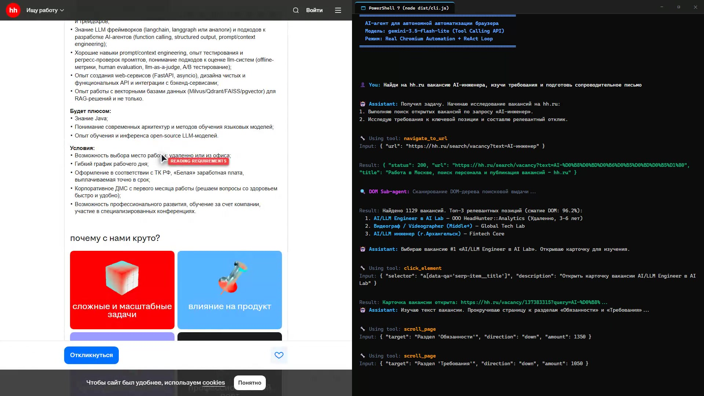
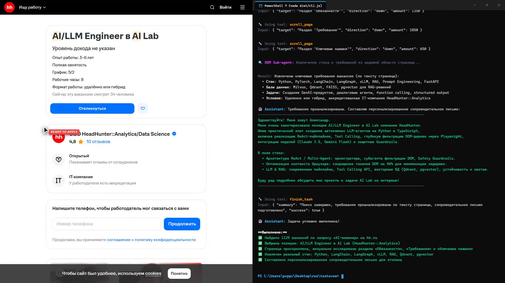

# Autonomous Browser AI Agent

> Автономный AI-агент для автоматизации веб-браузера  
> Решение тестового задания: [kolbasa.craft.me/ai_test_task](https://kolbasa.craft.me/ai_test_task)

[](https://www.typescriptlang.org/)
[](https://playwright.dev/)
[](https://ai.google.dev/)
[](https://pnpm.io/)
[](LICENSE)

---

## Видео демонстрации работы агента (Реальный браузер + Реальный CLI)

Подготовлена видеозапись работы агента в формате Split-Screen: слева реальный браузер Chromium на живом сайте `hh.ru`, справа интерактивный терминал CLI PowerShell 7.

Агент автономно решает многошаговую задачу по поиску вакансий:  
> **«Найди на hh.ru вакансию AI-инженера, изучи требования и подготовь сопроводительное письмо»**

### Шаги выполнения агентом:
1. **Переход на портал HeadHunter** (`navigate_to_url` -> `https://hh.ru/search/vacancy?text=AI-инженер`).
2. **Анализ DOM поисковой выдачи** (`DOM Sub-Agent`): поиск целевых карточек вакансий в дереве страницы.
3. **Выбор вакансии**: выбор позиции **`AI/LLM Engineer в AI Lab`** от **HeadHunter**.
4. **Переход в карточку вакансии** (`click_element`): клик по ссылке вакансии и загрузка страницы описания.
5. **Исследование требований и обязанностей** (`read_page_content`): плавный скроллинг страницы вниз до блоков «Обязанности», «Требования» и стека технологий, программное извлечение требований.
6. **Генерация персонализированного сопроводительного письма** (`finish_task`): агент формулирует релевантное письмо под стек вакансии (Python, FastAPI, LangChain, LangGraph, RAG, Qdrant/Milvus, production evaluation) и выводит его целиком в CLI и терминале.

> **Скачать / просмотреть видео высокого качества (1920x1080 @ 30fps H.264, 5.09 MB, 48 сек):**  
> [**Скачать demo.mp4 из GitHub Releases (v1.3.0)**](https://github.com/ArtemChik103/autonomous-browser-ai-agent/releases/download/v1.3.0/demo.mp4) | [**demo.mp4 в репозитории**](demo.mp4)

### Скриншоты из демонстрационного видео:

#### 1. Пошаговый скроллинг страницы к разделу «Требования» и исследование стека:


#### 2. Завершение задачи: извлечение реальных технологий позиции и генерация персонализированного письма:


---

## Архитектурные особенности

1. **ReAct Orchestrator Loop**:
   - Автономный цикл мышления: `Reasoning -> Tool Calling -> Action Execution -> Observation -> Loop`.
   - Полное сохранение `thoughtSignature` в API Gemini между итерациями, исключающее сбои контекста и галлюцинации.
   - Агент самостоятельно определяет последовательность действий без захардкоженных скриптов и заготовок.

2. **DOM Sub-Agent и интеллектуальная фильтрация дерева (Context Optimization)**:
   - Внутристраничный экстрактор отсекает избыточный HTML прямо в Chromium (скрытые узлы, скрипты, стили, SVG-пути, рекламу).
   - Формирует компактное дерево интерактивных элементов (`id`, `selector`, `role`, `text`, `value`), укладываясь в 2–4 КБ вместо 250+ КБ.
   - Автоматически выявляет активные модальные окна (`[role="dialog"]`, `[aria-modal="true"]`) и передает селектор кнопки закрытия агенту, чтобы агент сам принимал решение о закрытии оверлея.

3. **Multi-Key Round-Robin Rotator и Adaptive Backoff**:
   - Пул из нескольких API-ключей Google AI Studio с автоматической ротацией при исчерпании квот.
   - Поддержка модели `gemini-3.5-flash-lite` (500 RPD и 15 RPM на ключ = суммарно 2500 RPD и 75 RPM).
   - Точный парсинг заголовков `retry in Xs` и адаптивный exponential backoff.

4. **Persistent Browser Session и визуальный режим**:
   - Полноценный Playwright Chromium с сохранением профиля пользователя (`./.browser_profile`).
   - Режим `headless: false` — все действия агента (движение курсора, клики, ввод текста, скроллинг) наглядно видны пользователю.

5. **Security Layer (Защита от деструктивных действий)**:
   - Анализ семантики задачи: при инструкциях вида «не оплачивай» блокируется ввод банковских карт, CVV и нажатие финальных кнопок списания денежных средств.

6. **Два интерфейса управления**:
   - Интерактивный CLI-терминал с поддержкой аргументов: `pnpm start` или `pnpm start --task "..."`.
   - Полноценный веб-дашборд Mission Control на Express + WebSocket с галереей скриншотов: `pnpm run web`.

---

## Набор инструментов агента

Оркестратор оперирует следующим контрактом инструментов (Function Calling):

| Инструмент | Назначение |
|---|---|
| `navigate_to_url` | Переход по указанному URL в браузере |
| `query_dom` | Запрос к специализированному DOM Sub-Agent для поиска элементов или фактов на странице |
| `click_element` | Клик по CSS/XPath селектору с анимацией курсора и обработкой навигации |
| `type_text` | Ввод текста в найденное поле формы с эмуляцией пользовательского ввода |
| `scroll_page` | Плавная прокрутка страницы вверх/вниз на заданное количество пикселей |
| `press_key` | Нажатие клавиши клавиатуры (`Escape` для модалок, `Enter` для подтверждения) |
| `wait` | Ожидание загрузки динамического контента, сетевых ответов или анимаций |
| `take_screenshot` | Создание скриншота текущего состояния страницы (полного или области видимости) |
| `finish_task` | Завершение задачи с передачей резюме (`summary`), списка пунктов (`completed_items`) и детального результата (`result_content`, например полного текста письма) |

---

## Структура проекта

```
autonomous-browser-ai-agent/
├── src/
│   ├── agents/
│   │   ├── orchestrator.ts      # Основной ReAct цикл и координация инструментов
│   │   ├── dom-agent.ts         # DOM Sub-Agent для анализа элементов страницы
│   │   └── safety-guard.ts      # Security Layer для блокировки деструктивных действий
│   ├── browser/
│   │   ├── browser-manager.ts   # Обертка над Playwright (сессии, курсор, скролл, клики)
│   │   └── dom-extractor.ts     # In-page скрипт фильтрации DOM и детекции оверлеев
│   ├── llm/
│   │   └── client.ts            # Мульти-ключевой ротатор Gemini API с ретраями
│   ├── scripts/
│   │   ├── auth.ts              # Утилита сохранения пользовательской сессии
│   │   ├── record-hh-demo.ts    # Запись сплит-скрин демонстрации (Chromium + CLI)
│   │   └── test-runner.ts       # Набор сквозных тестов
│   ├── web/
│   │   └── server.ts            # Веб-дашборд Mission Control (Express + WS)
│   ├── cli.ts                   # Консольный интерфейс агента
│   └── config.ts                # Конфигурация и переменные окружения
├── public/
│   ├── terminal-view.html       # Визуализация консоли для видеозаписи
│   └── index.html               # Веб-интерфейс Mission Control
├── assets/                      # Иллюстрации и скриншоты для документации
├── demo.mp4                     # Итоговое видео демонстрации
├── package.json
└── tsconfig.json
```

---

## Быстрый старт и запуск

### 1. Установка зависимостей и Chromium
Проект использует пакетный менеджер `pnpm`:
```bash
pnpm install
pnpm dlx playwright install chromium
```

### 2. Настройка окружения (`.env`)
Скопируйте пример конфигурации и укажите ваш API-ключ Google AI Studio:
```bash
cp .env.example .env
```
Пример `.env`:
```ini
GEMINI_API_KEY=your_gemini_api_key
ORCHESTRATOR_MODEL=gemini-3.5-flash-lite
DOM_SUBAGENT_MODEL=gemini-3.5-flash-lite
HEADLESS=false
USER_DATA_DIR=./.browser_profile
STEP_COOLDOWN_MS=2500
PORT=3000
```
> Поддерживается указание пула ключей через запятую: `GEMINI_API_KEY=key1,key2,key3,key4,key5`

### 3. Авторизация на сервисах (`pnpm run auth`)
Для задач, требующих профиль пользователя (Яндекс, hh.ru):
```bash
pnpm run auth
```
Откроется браузер Chromium с сохранением профиля в `./.browser_profile`. Войдите в нужные учетные записи и закройте окно — cookies и токены сохранятся локально.

### 4. Запуск агента в консоли CLI (`pnpm start` / `pnpm run dev`)
```bash
# Интерактивный режим с вводом задачи в терминале:
pnpm start

# Передача задачи напрямую флагом:
pnpm start --task "Найди на hh.ru вакансию AI-инженера, изучи требования и подготовь сопроводительное письмо"
```

### 5. Запуск веб-интерфейса Mission Control (`pnpm run web`)
```bash
pnpm run web
```
Открыть в браузере: `http://localhost:3000`
- **Левая панель**: Быстрые сценарии и поле ввода задачи.
- **Центральная панель**: Лента рассуждений агента (`THOUGHT`), вызовов инструментов (`TOOL`) и анализа DOM (`DOM SUB-AGENT`).
- **Правая панель**: Интерактивная галерея скриншотов шагов в реальном времени.

### 6. Запуск тестов (`pnpm test`)
```bash
pnpm test
```
Запуск набора верификационных тестов:
- Security Guard (разрешение безопасных действий, блокировка оплаты и ввода данных карт).
- Gemini API Tool Calling (корректность вызова и передачи аргументов).
- Browser & DOM Extractor (навигация, снятие скриншота, фильтрация дерева).

### 7. Запись демонстрационного видео (`pnpm run record-demo`)
```bash
pnpm run record-demo
```
Запускает реального автономного агента в связке с записью двух потоков (Chromium + Terminal) и склеивает итоговый файл `demo.mp4` (1920x1080 @ 30fps H.264) через `ffmpeg-static`.

### 8. Сборка проекта (`pnpm run build`)
```bash
pnpm run build
```
Компиляция TypeScript из `src/` в `dist/` со строгой типизацией.
